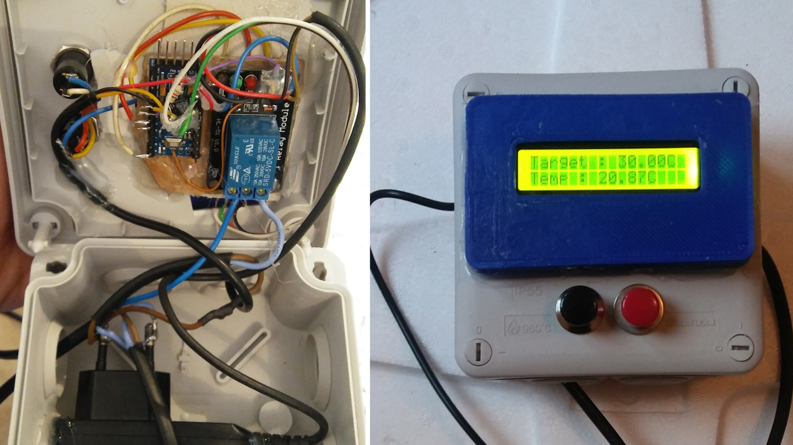

# Incubator

This is a simple but precise (drift less than 1°C) design to make an incubator. It can be used to incubate eggs, fungus, bacteria, yeasts... or make yogurt, tempeh...

There are three main parts :

	- Box (like a cooler, or polystyrene box...)
	- Reptile Heat Cable
	- Precise thermostat

This is how you can built a thermostat with an Arduino (or clone), a relay and a temperature sensors. The total cost is around 5€ with an Arduino clone, but if you can, try to buy true Arduino products to support the team.

## Parts and schematic for the thermostat

**List of parts**

	- Old 5 volts cellphone charger (minimum 300mA)
	- Male 220 volts plug with cable
	- Female 220 volts plug with cable
	- A 5 volts relay shield
	- A 5 volts Arduino microcontroler (mine is a Mini Pro, but any 5 volts boards should work)
	- Two momentary buttons
	- A Dallas temperature sensor (DS18B20)
	- A 4.7K ohms resistor
	- A LCD HD44780 with a Serial I2C backpack like PCF8574 shields for make connections easier
	

**TO DO : Draw a schematic**

## Calibration

Two buffers avoid the box inertia and make your thermostat more precise. For a perfect accuracy, buffers need to be calculated for each target temperature, but the precision is not to bad with a single calibration, around 0 - 0.30 °C for a calibration at 30 °C (that means the temperature stays between 30°C and 30.30°C). 
Two factors can improved the precision : a perfect isolated box (no holes), and a well-fixed temp sensor (the temperature isn't really the same in all of the box, I haven't try to put a little fan for homogenize cool and hot zones but it can be a solution. Personally I'm a bit affraid with the circulation of contaminants). 

**TO DO : tips to calculate buffers**

## Pictures

